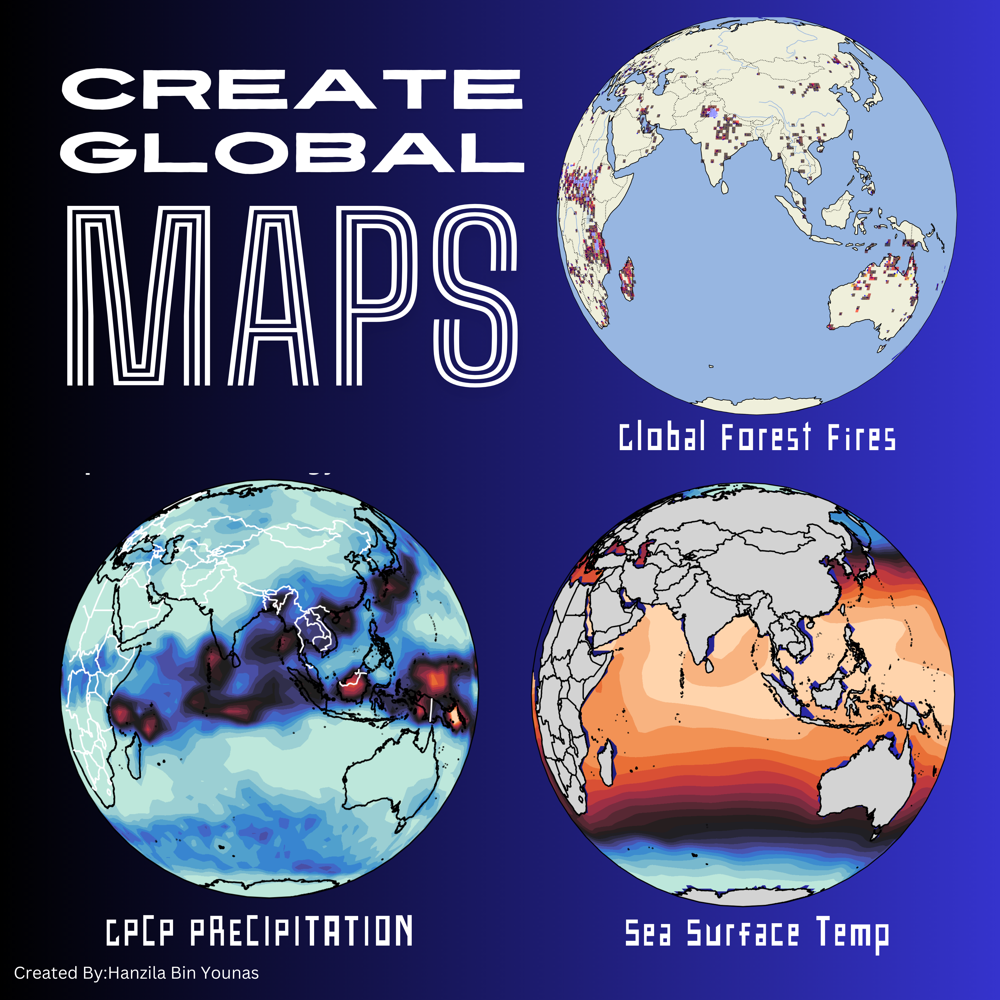

# Global Climatic Mapping

A collection of Jupyter notebooks for visualizing global climate data including forest fires, precipitation patterns, and sea surface temperatures.



## Overview

This repository contains tools for analyzing and visualizing various global climate phenomena using Python and satellite data from different sources.

### Available Visualizations

1. **Forest Fire Mapping**: Visualizes global fire events using NASA FIRMS data
2. **Global Precipitation**: Maps worldwide precipitation patterns
3. **Sea Surface Temperature**: Displays ocean temperature variations globally

## Data Sources

- Forest Fire Data: NASA FIRMS (Fire Information for Resource Management System)
- Precipitation Data: NASA GPM (Global Precipitation Measurement)
- Sea Surface Temperature: NOAA (National Oceanic and Atmospheric Administration)

## Requirements

- Python 3.7+
- Jupyter Notebook
- Required Python packages:
  - pandas
  - numpy
  - matplotlib
  - cartopy
  - seaborn

## Installation & Setup

1. Clone the repository:
```bash
git clone https://github.com/yourusername/Global-Climatic-Mapping.git
```

2. Install required packages:
```bash
pip install pandas numpy matplotlib cartopy seaborn
```

## Usage

### Local Setup

1. Navigate to the project directory
2. Launch Jupyter Notebook:
```bash
jupyter notebook
```
3. Open any of the three notebooks:
   - `Global_ForestFire_Mapping.ipynb`
   - `Global_Precipitation_Mapping.ipynb`
   - `Global_SeaSurfaceTemperature_Mapping.ipynb`

### Google Colab

These notebooks can also be run on Google Colab:

1. Upload the notebooks to your Google Drive
2. Open with Google Colab
3. Run all cells (additional package installation cells are included)

## Notebooks Description

1. **Global_ForestFire_Mapping.ipynb**
   - Visualizes global fire events
   - Uses 1-degree grid system
   - Includes intensity analysis

2. **Global_Precipitation_Mapping.ipynb**
   - Maps global precipitation patterns
   - Includes seasonal analysis
   - Shows rainfall intensity distributions

3. **Global_SeaSurfaceTemperature_Mapping.ipynb**
   - Displays sea surface temperature variations
   - Includes temporal analysis
   - Shows temperature anomalies

## Sample Data

The repository includes a sample data file (`VIIRSNDE_global2018312.v1.0.txt`) for testing the forest fire mapping functionality.

## Contributing

Contributions are welcome! Please feel free to submit a Pull Request.

## License

This project is licensed under the MIT License - see the LICENSE file for details.

## Acknowledgments

- NASA FIRMS for fire detection data
- NOAA for sea surface temperature data
- NASA GPM for precipitation data
